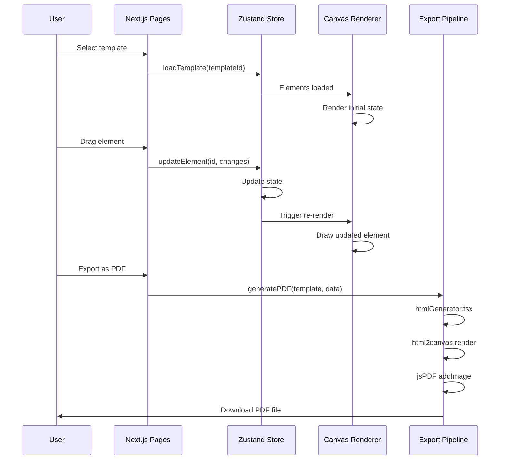

# Certificator System Architecture

## Executive Summary

Certificator is a **client-side only** certificate design and generation platform built with Next.js 14, React 18, and TypeScript. The system uses a state-first architecture with Zustand for global state management and leverages browser Canvas API for real-time rendering.

**Core Philosophy:** *No backend. No database. No servers. Just drag, design, and download.*

---

## Table of Contents

1. [System Overview](#system-overview)
2. [Architecture Layers](#architecture-layers)
3. [Data Flow](#data-flow)
4. [State Management](#state-management)
5. [Component Architecture](#component-architecture)
6. [Canvas System](#canvas-system)
7. [PDF Generation Pipeline](#pdf-generation-pipeline)
8. [Export & Storage](#export--storage)
9. [Performance Characteristics](#performance-characteristics)
10. [Future Architecture Plans](#future-architecture-plans)

---

## System Overview

### Design Principles

```
┌─────────────────────────────────────────────────────┐
│         Certificator System Architecture            │
├─────────────────────────────────────────────────────┤
│                                                     │
│  ┌──────────────────────────────────────────────┐  │
│  │         User Interface Layer                 │  │
│  │  (Next.js Pages + React Components)          │  │
│  └──────────────────────────────────────────────┘  │
│                      ↗ ↖                           │
│  ┌──────────────────────────────────────────────┐  │
│  │      Canvas Rendering Engine                │  │
│  │  (HTML5 Canvas + Transformation Matrix)      │  │
│  └──────────────────────────────────────────────┘  │
│                      ↗ ↖                           │
│  ┌──────────────────────────────────────────────┐  │
│  │    State Management (Zustand)                │  │
│  │  - Editor Store                              │  │
│  │  - Template Store                            │  │
│  │  - Toast Store                               │  │
│  └──────────────────────────────────────────────┘  │
│                                                     │
│  ┌──────────────────────────────────────────────┐  │
│  │    Export Pipeline                          │  │
│  │  - PDF Generation (jsPDF + html2canvas)     │  │
│  │  - ZIP Creation (JSZip)                      │  │
│  └──────────────────────────────────────────────┘  │
│                                                     │
└─────────────────────────────────────────────────────┘
```

### Key Characteristics

| Aspect | Value |
|--------|-------|
| **Frontend Framework** | Next.js 14.2.35 |
| **UI Library** | React 18.3.1 |
| **Type Safety** | TypeScript 5.4.4 (strict mode) |
| **State Management** | Zustand 4.4.1 |
| **Styling** | Tailwind CSS 3.3 |
| **Canvas Rendering** | HTML5 Canvas API |
| **PDF Generation** | jsPDF 2.5.1 + html2canvas 1.4.1 |
| **Data Processing** | XLSX 0.18.5 |
| **Package Format** | JSZip 3.10.1 |
| **Deployment** | Client-side only (no backend) |

---

## Architecture Layers

### 1. Presentation Layer (UI)

**Location:** `src/app/`, `src/components/`

**Responsibilities:**
- Render user interface
- Capture user input
- Display canvas and editor controls
- Show notifications and feedback

**Key Routes:**

```
/                    → Dashboard (home page)
/create              → Template creation flow
/editor/[id]         → Canvas editor
/bulk-generate       → Bulk certificate generation
```

**Page Structure:**

```typescript
// src/app/layout.tsx
// Root layout with ClientLayoutWrapper for ToastContainer

// src/app/page.tsx
// Dashboard with template selection

// src/app/editor/[id]/page.tsx
// Full-featured canvas editor
```

### 2. Canvas Rendering Layer

**Location:** `src/components/editor/Canvas.tsx`, `src/utils/`

**Responsibilities:**
- Render certificate elements on HTML5 Canvas
- Handle transformations (translate, rotate, scale)
- Manage zoom and pan
- Calculate snap guides
- Render selection indicators

**Key Concepts:**

1. **Transformation Matrix**
   - Tracks canvas viewport position and zoom
   - Applies to all rendering operations
   - Used for pointer event translation

2. **Element Rendering**
   - Each element type (text, image, shape) renders differently
   - Z-index order determines rendering sequence
   - Clipping applied for element bounds

3. **Guide System**
   - Smart guides: snap to center, edges, alignment
   - Grid guides: optional snap-to-grid
   - Shown as colored lines during drag operations

### 3. State Management Layer

**Location:** `src/store/`

**Zustand Stores:**

#### useEditorStore
```typescript
interface EditorState {
  // Canvas state
  zoomLevel: number;
  canvasX: number;
  canvasY: number;
  
  // Element state
  elements: Element[];
  selectedElementIds: string[];
  
  // History
  history: Element[][];
  historyIndex: number;
  
  // Selections & interactions
  draggingElement?: string;
  resizingElement?: string;
  
  // Actions
  addElement: (element: Element) => void;
  updateElement: (id: string, changes: Partial<Element>) => void;
  deleteElement: (id: string) => void;
  selectElement: (id: string, multiSelect?: boolean) => void;
  // ... many more actions
}
```

#### useTemplateStore
```typescript
interface TemplateState {
  // Template data
  currentTemplate: CertificateTemplate;
  
  // Saved templates
  savedTemplates: CertificateTemplate[];
  
  // Actions
  loadTemplate: (templateId: string) => void;
  saveTemplate: (template: CertificateTemplate) => void;
  deleteTemplate: (templateId: string) => void;
  // ... more actions
}
```

#### useToastStore
```typescript
interface ToastState {
  toasts: Toast[];
  
  addToast: (toast: Omit<Toast, 'id'>) => void;
  removeToast: (id: string) => void;
  clearAllToasts: () => void;
}

interface Toast {
  id: string;
  type: 'success' | 'error' | 'warning' | 'info';
  message: string;
  duration?: number;  // milliseconds
}
```

### 4. Business Logic Layer

**Location:** `src/hooks/`, `src/utils/`

**Custom Hooks:**
- `useCanvasScale.ts` - Zoom and pan calculations
- `usePrinter.ts` - PDF and ZIP generation
- `useExcelParser.ts` - Excel file processing
- `useConfetti.ts` - Celebration animations
- `useCSSVariables.ts` - Dynamic theming

**Utility Functions:**
- `htmlGenerator.ts` - HTML string generation for export
- `guideCalculations.ts` - Smart guide detection
- `pointerSensitivity.ts` - Mouse pointer sensitivity
- `validators.ts` - Data validation
- `formatters.ts` - Text formatting (dates, numbers)

### 5. Data Processing Layer

**Location:** `src/utils/`, `src/hooks/`

**Responsibilities:**
- Parse Excel files
- Generate HTML from template + data
- Create PDF documents
- Package certificates into ZIP
- Validate user input

**Key Flows:**

```
Excel File → XLSX Parser → Data Array ↓
           ↓
Template + Data → HTML Generator ↓
           ↓
HTML + Canvas → html2canvas → Image ↓
             → jsPDF → PDF Document ↓
                                ↓
Multiple PDFs → JSZip → ZIP File (download)
```

---

## Data Flow

### 1. Certificate Creation Flow



### 2. Bulk Generation Flow

```
1. User uploads Excel file
   ↓
2. useExcelParser extracts rows
   ↓ (for each row)
3. Template + row data → htmlGenerator
   ↓
4. HTML → html2canvas → PNG
   ↓
5. PNG → jsPDF → PDF
   ↓
6. All PDFs → JSZip → ZIP
   ↓
7. User downloads ZIP
```

### 3. State Update Flow

```
User Action (click, drag, type)
    ↓
Component handler captures event
    ↓
Calls Zustand action (e.g., updateElement)
    ↓
Zustand updates internal state
    ↓
React re-renders affected components
    ↓
Canvas component calls render function
    ↓
Canvas redraws with new state
    ↓
Browser displays updated canvas
```

---

## State Management

### Zustand Pattern

Certificator uses Zustand for lightweight, scalable state management:

```typescript
// src/store/useEditorStore.ts
import { create } from 'zustand';

export const useEditorStore = create<EditorState>((set, get) => ({
  // Initial state
  elements: [],
  selectedElementIds: [],
  zoomLevel: 1,
  
  // Actions
  addElement: (element) => set((state) => ({
    elements: [...state.elements, element],
  })),
  
  // Complex actions with access to state
  updateElement: (id, changes) => set((state) => ({
    elements: state.elements.map(el =>
      el.id === id ? { ...el, ...changes } : el
    ),
  })),
  
  // Async initialization
  loadTemplate: async (templateId) => {
    const template = await fetchTemplate(templateId);
    set({ elements: template.elements });
  },
}));

// Usage in components
function MyComponent() {
  const elements = useEditorStore((state) => state.elements);
  const addElement = useEditorStore((state) => state.addElement);
  
  // Component code...
}
```

### Why Zustand?

| Feature | Benefit |
|---------|---------|
| **Lightweight** | ~2KB minified, no boilerplate |
| **TypeScript Support** | Full type inference |
| **Selector Pattern** | Only re-render when selected state changes |
| **Middleware Support** | Easy to add logging, persistence |
| **Simple API** | Easy to learn and use |

### Data Persistence

Currently, templates are stored in:
1. **Browser State** (during session)
2. **localStorage** (optional, via custom hooks)
3. **Exported Files** (JSON for import later)

**Future Plan:** Backend database integration for v2.1+

---

## Component Architecture

### Component Hierarchy

```
ClientLayoutWrapper
├── ToastContainer (portal)
├── RootLayout
│   ├── Header/Navigation
│   └── Page
│       └── Specific Page Components
│           ├── Canvas
│           │   └── CanvasElements (rendered)
│           ├── ToolPanel
│           ├── LayerPanel
│           └── PropertiesPanel
```

### Component Types

#### Page Components (`src/app/`)
- Entry points for routes
- Handle top-level layout
- Manage page-level state
- Examples: `page.tsx`, `editor/[id]/page.tsx`

#### Container Components
- Manage sub-state for their section
- Coordinate with Zustand store
- Handle complex logic
- Example: `SystemLayoutPicker.tsx`

#### Presentational Components
- Pure UI rendering
- Accept props only
- No side effects
- Examples: `Button.tsx`, `ColorPicker.tsx`

#### Composite Components
- Combine multiple presentational components
- Local state for UI (open/closed, hovering)
- Examples: `PropertiesPanel.tsx`, `LayerPanel.tsx`

### Component Guidelines

```typescript
// ✓ GOOD: Proper component structure
'use client';

import { FC, useState } from 'react';
import { useEditorStore } from '@/store/useEditorStore';

interface MyComponentProps {
  elementId: string;
  onUpdate?: (changes: Record<string, unknown>) => void;
}

const MyComponent: FC<MyComponentProps> = ({ elementId, onUpdate }) => {
  const [isOpen, setIsOpen] = useState(false);
  const element = useEditorStore(state => 
    state.elements.find(el => el.id === elementId)
  );
  
  if (!element) return null;
  
  return (
    <div className="component">
      {/* Component content */}
    </div>
  );
};

export default MyComponent;
```

---

## Canvas System

### Canvas Architecture

The canvas system is the heart of Certificator:

```
┌─────────────────────────────┐
│    HTML5 Canvas Element     │  <- Raw browser canvas
│  (width: 1000, height: 600) │
└─────────────────────────────┘
           ↑  ↓
        Drawing API
           ↑  ↓
┌─────────────────────────────┐
│   Rendering Engine          │  <- Canvas.tsx component
│  - Transform matrix         │
│  - Element rendering        │
│  - Guide rendering          │
│  - Selection indicators     │
└─────────────────────────────┘
           ↑  ↓
    State & Events
           ↑  ↓
┌─────────────────────────────┐
│   Event Handlers            │  <- Pointer events
│  - Mouse move               │
│  - Mouse down/up            │
│  - Keyboard                 │
│  - Touch (planned)          │
└─────────────────────────────┘
           ↑  ↓
┌─────────────────────────────┐
│   Zustand Store             │  <- Global state
│  - Element positions        │
│  - Selected elements        │
│  - Zoom/Pan state           │
└─────────────────────────────┘
```

### Coordinate Systems

**Canvas Coordinate System:**
- Origin (0,0) at top-left
- X increases right
- Y increases down
- Units: pixels

**Element Coordinate System:**
- Relative to canvas origin
- Each element has x, y, width, height
- Rotation around center point

**Viewport Transformation:**
```typescript
// Transform from screen space to canvas space
screenPoint → apply inverse transform matrix → canvasPoint

// Transform from canvas space to screen space  
canvasPoint → apply transform matrix → screenPoint
```

### Rendering Pipeline

```typescript
// src/components/editor/Canvas.tsx

function Canvas() {
  const canvasRef = useRef<HTMLCanvasElement>(null);
  const elements = useEditorStore(state => state.elements);
  const zoom = useEditorStore(state => state.zoomLevel);
  const selectedIds = useEditorStore(state => state.selectedElementIds);
  
  // Main render effect
  useEffect(() => {
    const canvas = canvasRef.current;
    if (!canvas) return;
    
    const ctx = canvas.getContext('2d');
    if (!ctx) return;
    
    // Clear canvas
    ctx.clearRect(0, 0, canvas.width, canvas.height);
    
    // Apply viewport transformation
    ctx.save();
    ctx.translate(canvasX, canvasY);
    ctx.scale(zoom, zoom);
    
    // Draw background
    drawBackground(ctx);
    
    // Draw elements in order
    elements.forEach(element => {
      drawElement(ctx, element);
    });
    
    // Draw guides if dragging
    if (draggingElementId) {
      drawAlignmentGuides(ctx, element);
    }
    
    // Draw selection
    selectedIds.forEach(id => {
      drawSelectionBox(ctx, elementById(id));
    });
    
    ctx.restore();
  }, [elements, zoom, selectedIds, draggingElementId]);
  
  // Handle events...
  return <canvas ref={canvasRef} />;
}
```

### Element Types

```typescript
type Element = TextElement | ImageElement | ShapeElement;

interface BaseElement {
  id: string;
  type: 'text' | 'image' | 'shape';
  x: number;
  y: number;
  width: number;
  height: number;
  rotation: number;  // degrees
  opacity: number;   // 0-1
  zIndex: number;
}

interface TextElement extends BaseElement {
  type: 'text';
  content: string;
  fontSize: number;
  fontFamily: string;
  color: string;
  align: 'left' | 'center' | 'right';
}

interface ImageElement extends BaseElement {
  type: 'image';
  src: string;
  cropX?: number;
  cropY?: number;
  cropWidth?: number;
  cropHeight?: number;
}

interface ShapeElement extends BaseElement {
  type: 'shape';
  shapeType: 'rectangle' | 'circle' | 'line';
  backgroundColor: string;
  borderColor: string;
  borderWidth: number;
}
```

---

## PDF Generation Pipeline

### Overview

```
Certificate Data + Template
    ↓
HTML Generator (htmlGenerator.ts)
    ↓
HTML String
    ↓
html2canvas Renderer
    ↓
Canvas Image (PNG)
    ↓
jsPDF Document
    ↓
PDF File
    ↓
Download to User
```

### Step-by-Step Process

### 1. HTML Generation
```typescript
// src/utils/htmlGenerator.ts
export function generateCertificateHTML(
  template: CertificateTemplate,
  data: CertificateData
): string {
  // Create HTML string with all elements
  // Replace variables: {name} → data.name
  // Apply exact styling from canvas
  // Return as HTML string
}
```

### 2. Canvas Rendering
```typescript
// src/hooks/usePrinter.ts
const canvas = await html2canvas(htmlElement, {
  scale: 2,                           // High resolution
  useCORS: true,                      // Handle cross-origin images
  allowTaint: true,                   // Allow tainted canvas
  backgroundColor: '#ffffff',         // White background
  logging: false,                     // No debug logs
});
```

### 3. PDF Creation
```typescript
const pdf = new jsPDF({
  orientation: 'landscape',
  unit: 'mm',
  format: 'a4',
});

const imgData = canvas.toDataURL('image/png');
pdf.addImage(imgData, 'PNG', 0, 0, 297, 210);  // A4 landscape
```

### Resolution Settings

```typescript
// DPI Settings for Export
// Current: 150 DPI (standard for screen display)
// Used in usePrinter.ts

const DPI = 150;
const PIXELS_PER_INCH = DPI;

// Image quality
scale: 2,  // 2x device pixel ratio = better quality
```

### Bulk Export Process

```typescript
// src/hooks/usePrinter.ts - bulkGenerate function

async function generateBulkCertificates(
  template: CertificateTemplate,
  dataRows: CertificateData[]
) {
  const pdfs: jsPDF[] = [];
  
  // Generate PDF for each row
  for (const row of dataRows) {
    const html = generateCertificateHTML(template, row);
    const canvas = await html2canvas(html);
    const pdf = createPDF(canvas);
    pdfs.push(pdf);
    
    // Show progress
    updateProgress((current) => current + 1);
  }
  
  // Combine into ZIP
  const zip = new JSZip();
  pdfs.forEach((pdf, index) => {
    zip.file(`Certificate_${index + 1}.pdf`, pdf.output('blob'));
  });
  
  // Download ZIP
  const zipBlob = await zip.generateAsync({ type: 'blob' });
  downloadFile(zipBlob, 'certificates.zip');
}
```

---

## Export & Storage

### Local Storage

**What's Stored:**
- User preferences (zoom level, recent templates)
- Template definitions (JSON)
- Undo/redo history (element snapshots)

**Implementation:**
```typescript
// Optional localStorage persistence
localStorage.setItem('certificator:template', JSON.stringify(template));
const saved = JSON.parse(localStorage.getItem('certificator:template'));
```

### File Formats

#### Template Export (JSON)
```json
{
  "id": "tmpl_12345",
  "name": "Award Certificate",
  "width": 1000,
  "height": 600,
  "elements": [
    {
      "id": "el_1",
      "type": "text",
      "content": "{recipientName}",
      "x": 500,
      "y": 300,
      "fontSize": 48
    }
  ],
  "brandLogos": ["logo1.png", "sponsor.png"]
}
```

#### Certificate Data (CSV/Excel)
```
recipientName,recipientEmail,certificateDate
John Doe,john@example.com,2026-03-11
Jane Smith,jane@example.com,2026-03-11
```

### Download Mechanism

```typescript
// src/utils/
export function downloadFile(blob: Blob, filename: string) {
  const url = URL.createObjectURL(blob);
  const link = document.createElement('a');
  link.href = url;
  link.download = filename;
  document.body.appendChild(link);
  link.click();
  document.body.removeChild(link);
  URL.revokeObjectURL(url);
}
```

---

## Performance Characteristics

### Rendering Performance

| Scenario | Performance | Notes |
|----------|-------------|-------|
| **Canvas with 10 elements** | 60 FPS | Smooth interactions |
| **Canvas with 30 elements** | 50-60 FPS | Slight lag on drag |
| **Canvas with 50+ elements** | 30-45 FPS | Consider splitting to multiple sheets |
| **High DPI export (300 DPI)** | 3-5 sec | Good quality PDF |
| **Bulk: 100 certificates** | 45-60 sec | Depends on system |

### Memory Usage

- **Idle**: ~15 MB
- **Active editor (50 elements)**: ~35 MB
- **During bulk export (100 certs)**: ~100-150 MB
- **After export**: Returns to idle

### Optimization Strategies

1. **Canvas Rendering**
   - Use `requestAnimationFrame` for smooth updates
   - Debounce pointer events for drag operations
   - Cache computed guides

2. **Component Rendering**
   - Use Zustand selectors to prevent unnecessary re-renders
   - Memoize expensive computations
   - Code-split heavy pages

3. **Image Handling**
   - Compress images before upload (< 200KB)
   - Use WebP format where supported
   - Lazy load in gallery views

4. **State Management**
   - Don't store derived values in state
   - Clear undo/redo history periodically
   - Unload unused data

---

## Future Architecture Plans

### v2.1 – Advanced Features

**Planned:**
- [ ] Custom fonts (Google Fonts integration)
- [ ] Advanced text formatting (bold, italic, strikethrough)
- [ ] Nested groups/layers
- [ ] Template variants system
- [ ] Cloud storage (Firebase/AWS)

**Architecture Impact:**
- Add font service layer
- Extend element type system
- Add grouping to canvas engine
- Add auth module

### v2.2 – Collaboration

**Planned:**
- [ ] Real-time collaboration (Yjs + WebSocket)
- [ ] User accounts and authentication
- [ ] Shared templates
- [ ] Version history

**Architecture Changes:**
- Add backend service (Node.js/Express)
- Add WebSocket layer
- Add auth middleware
- Change state sync strategy

### v2.3+ – Advanced Export

**Planned:**
- [ ] Multiple export formats (PowerPoint, etc.)
- [ ] Incremental ZIP streaming (for 1000+ certs)
- [ ] Email integration
- [ ] FTP upload support
- [ ] Cloud print APIs

**Architecture Impact:**
- Add export service abstraction
- Backend integration for email/FTP
- Queue system for very large batches

### Scaling Considerations

**For 1000+ Elements:**
- Virtualized canvas (render only visible elements)
- Spatial indexing (quad-tree for hit detection)
- Web Workers for CPU-heavy tasks
- Consider canvas chunks rather than single canvas

**For High-Concurrency Collaboration:**
- Use Yjs for CRDT-based conflict resolution
- WebSocket server with multi-room support
- Delta compression for state sync
- IndexedDB for local caching

---

## Design Patterns Used

### 1. Store Pattern (Zustand)
```typescript
// All state is managed in stores
// Selectors prevent unnecessary re-renders
// Middleware for persistence/logging
```

### 2. Hook Pattern
```typescript
// Custom hooks encapsulate logic
// Reusable across components
// Easy to test in isolation
```

### 3. Composition Pattern
```typescript
// Components composed from smaller pieces
// Props drilling minimized with context
// Flexible component layouts
```

### 4. Strategy Pattern (Export)
```typescript
// Different export strategies:
// - PDF single
// - PDF bulk
// - ZIP
// - JSON template
// Extensible for future formats
```

### 5. Observer Pattern (Canvas)
```typescript
// Store changes trigger re-renders
// Components subscribe to specific state
// Automatic synchronization
```

---

## Dependencies Analysis

### Core Dependencies

```json
{
  "next": "14.2.35",        // Framework (1.4 MB)
  "react": "18.3.1",        // UI library (42 KB)
  "typescript": "5.4.4",    // Type safety (dist only)
  "zustand": "4.4.1",       // State (2 KB)
  "tailwindcss": "3.3",     // Styling (dist only)
  "html2canvas": "1.4.1",   // Canvas export (146 KB)
  "jspdf": "2.5.1",         // PDF generation (184 KB)
  "xlsx": "0.18.5",         // Excel parsing (574 KB)
  "jszip": "3.10.1"         // ZIP creation (34 KB)
}
```

### Bundle Impact

- **Main bundle**: ~121 KB (gzipped)
- **Editor chunk**: ~22 KB (gzipped)
- **Total overhead**: ~150 KB

### Tree-shaking

All dependencies support tree-shaking. Only used functions are included in final bundle.

---

## Security Considerations

### Client-Side Only

**Advantages:**
- No server compromise exposure
- All processing on user's machine
- No data stored on servers
- GDPR compliant (no data collection)

**Limitations:**
- Can't validate file types server-side
- Can't rate-limit usage
- Can't prevent misuse

### Input Validation

```typescript
// Validate all user input
- File size limits (images: 10MB, excels: 50MB)
- File type checking (MIME types)
- String length limits (text content)
- Number ranges (DPI, dimensions)
```

### XSS Prevention

```typescript
// All dynamic content is sanitized
- User text rendered to canvas (not HTML)
- Images come from data URLs or CORS-enabled sources
- No innerHTML usage for user content
```

---

## Testing Strategy

### Unit Testing (Planned v2.1)

```typescript
// Test store actions
// Test utility functions
// Test component rendering
```

### Integration Testing (Planned v2.1)

```typescript
// Test canvas rendering workflow
// Test export pipeline
// Test data flow
```

### E2E Testing (Planned v2.2)

```typescript
// Test complete user workflows
// Test browser compatibility
// Test performance under load
```

---

## Monitoring & Analytics

### Current
- Browser console logs
- Build-time error reporting

### Planned (v2.2+)
- Error boundary for runtime crashes
- Performance metrics collection
- User interaction analytics
- Export success/failure tracking

---

## References

- [Next.js Architecture](https://nextjs.org/learn/foundations/how-nextjs-works)
- [React Patterns](https://react.dev/learn)
- [Canvas API](https://developer.mozilla.org/en-US/docs/Web/API/Canvas_API)
- [Zustand State Management](https://github.com/pmndrs/zustand)
- [TypeScript Handbook](https://www.typescriptlang.org/docs)

---

*Last Updated: March 11, 2026*
*Architecture version: 2.0*
*For detailed implementation, see DEVELOPMENT.md and code comments*
